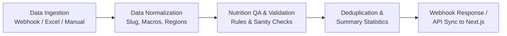

# 🔄 Poshan Meal Library n8n Workflow Guide

This guide details the automated **n8n workflow** designed to replicate, maintain, and scale the meal ingestion, validation, categorization, and enrichment pipeline defined in [`MEAL_LIBRARY_IMPLEMENTATION_LOG.md`](file:///C:/Users/Daksh/poshan/MEAL_LIBRARY_IMPLEMENTATION_LOG.md).

The workflow JSON is saved in your project root at:
[`meal_library_n8n_workflow.json`](file:///C:/Users/Daksh/poshan/meal_library_n8n_workflow.json)

---

## 🏗️ Architecture & Pipeline Overview

The workflow automates all 4 phases described in the meal library implementation:



### 1. Ingestion Sources (Phase 1 & 2)
- **Webhook Endpoint (`POST /webhook/meal-library`)**: For real-time updates from webhooks, Google Sheets, or CMS forms.
- **Manual / Schedule Trigger**: For batch processing of Excel spreadsheets (`india_784_meal_card_nutrition.xlsx`) or high-protein docs.
- **Sample Test Generator**: Included in the canvas for instant testing without external dependencies.

### 2. Normalization Engine
- Formats dish names and creates unique kebab-case IDs (`id: "paneer-tikka-power-bowl"`).
- Maps regional cuisines to standard Poshan keys (`north`, `south`, `east`, `west`).
- Normalizes meal times (`breakfast`, `lunch`, `dinner`, `snack`).
- Standardizes numerical macros (`protein`, `carbohydrate`, `fat`, `fibre`).

### 3. QA, Nutritional Verification & Business Rules (Phase 3 & 4)
- **Authentic Name Verification**: Detects and replaces generic placeholder names (e.g., `"north Meal 1"`).
- **Calorie Balance Integrity**: Verifies $4 \times \text{Protein} + 4 \times \text{Carbs} + 9 \times \text{Fat} \approx \text{kcal}$. Auto-adjusts drift exceeding $\pm 50 \text{ kcal}$.
- **FSSAI Dietary Classification**:
  - Automatically fixes sweets/desserts erroneously tagged as non-veg (e.g., Gulab Jamun, Halwa, Kheer $\rightarrow$ `veg`).
  - Enforces permitted meat filters for Indian kitchens (Chicken, Mutton, Fish, Prawn, Egg; rejects beef/turkey/pork).
- **Automated Poshan Tagging**:
  - `highProtein`: Auto-applied when `protein >= 25g` (Phase 4 requirement).
  - `lowGi`: Auto-applied when high fibre ($\ge 6\text{g}$) and low carbohydrates ($\le 35\text{g}$).
  - `ironRich`: Auto-applied for dishes featuring spinach/palak, rajma, chana, beetroot, etc.
  - `vegan`: Auto-applied for vegetarian dishes free from dairy (paneer, curd, milk, ghee) and egg.
  - `egg`: Auto-applied for egg-only preparations (anda bhurji, egg curry).
- **Subscription Tier Assignment**:
  - `premium`: Poshan Home high-protein meals ($\ge 25\text{g}$) and condition-specific recipes.
  - `free`: Base staple meals (poha, idli sambar, dal roti).

### 4. Output & Synchronization
- **Response**: Immediate structured JSON with comprehensive meal metadata and library statistics.
- **Next.js Sync**: Integrates with Poshan backend API to keep the meal library synchronized.

---

## 🚀 How to Import & Run in n8n

### Step 1: Open n8n
1. Open your n8n workspace (self-hosted or n8n Cloud).
2. Create a **New Workflow**.

### Step 2: Import Workflow JSON
1. Click the **`...` (Options)** menu in the top-right corner of the canvas.
2. Select **Import from File...** and select [`meal_library_n8n_workflow.json`](file:///C:/Users/Daksh/poshan/meal_library_n8n_workflow.json) (or copy-paste the raw JSON directly onto the canvas with `Ctrl+V`).

### Step 3: Test Execution
1. Click on the **Manual Trigger: Test Run** node.
2. Click **Test Step** or **Test workflow** at the bottom of the canvas.
3. Observe the outputs through each node:
   - `Normalize Meal Data` $\rightarrow$ cleans input fields
   - `Nutrition QA & Tagging Rules` $\rightarrow$ applies auto-tags, fixes categorization, and validates calories
   - `Deduplicate & Aggregate Stats` $\rightarrow$ outputs total meal counts, regional distribution, and macro breakdown.

---

## 📡 Webhook Usage & Payload Schema

### Webhook URL
`POST https://<your-n8n-domain>/webhook/meal-library`

### Example Request Body (Single Meal or Array)
```json
{
  "meals": [
    {
      "name": "Paneer Tikka Power Bowl",
      "region": "north",
      "time": "lunch",
      "category": "veg",
      "calories": 420,
      "protein": 34,
      "carbs": 28,
      "fat": 16,
      "fiber": 9,
      "ingredients": ["paneer", "bell peppers", "curd", "quinoa", "spinach"]
    }
  ]
}
```

### Processed Output Schema (`MealPlanItem`)
```json
{
  "status": "success",
  "stats": {
    "totalMeals": 1,
    "vegetarian": 1,
    "nonVegetarian": 0,
    "highProtein": 1,
    "vegan": 0,
    "lowGi": 1,
    "ironRich": 1,
    "regions": {
      "north": 1,
      "south": 0,
      "east": 0,
      "west": 0
    },
    "tiers": {
      "free": 0,
      "premium": 1
    }
  },
  "meals": [
    {
      "id": "paneer-tikka-power-bowl",
      "name": {
        "en": "Paneer Tikka Power Bowl",
        "hi": "पनीर टिक्का पावर बाउल"
      },
      "region": "north",
      "time": "lunch",
      "category": "veg",
      "tags": ["highProtein", "lowGi", "ironRich"],
      "kcal": 392,
      "macros": {
        "protein": 34,
        "carbohydrate": 28,
        "fat": 16,
        "fibre": 9
      },
      "note": {
        "en": "Paneer Tikka Power Bowl prepared in traditional north Indian style with balanced macros (34g protein, 9g fibre).",
        "hi": "पनीर टिक्का पावर बाउल पारंपरिक उत्तर भारतीय शैली में तैयार, संतुलित पोषण के साथ।"
      },
      "tier": "premium"
    }
  ]
}
```

---

## 🧩 Optional AI Node Extension (OpenAI / Gemini)

To dynamically generate complex Hindi culinary descriptions and recipe steps for new dishes, you can insert an **HTTP Request** or **AI LLM Agent** node between `Normalize Meal Data` and `Nutrition QA`:

```json
{
  "model": "gemini-2.5-flash",
  "prompt": "You are an Indian nutritionist. Given dish name '{{ $json.nameEn }}' from '{{ $json.region }}' India, generate:\n1. Accurate Hindi translation in Devanagari\n2. 1-sentence cultural and nutritional note in English and Hindi\n3. Verification of protein and fiber"
}
```
